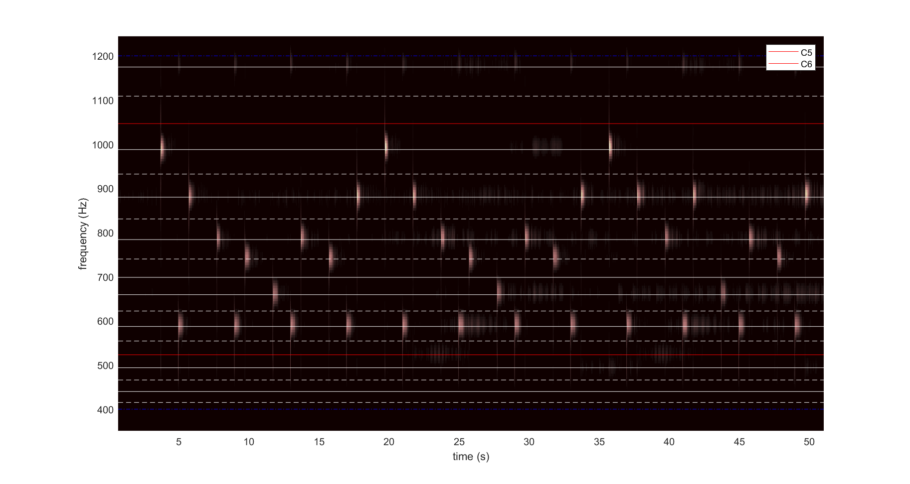

# Spectrogram with Notes

This Matlab program will plot the spectrogram with reference lines of notes. It can be used to analyze the melody of music. 

**The result of running the program.** The red lines indicate the C notes. The lower one is C5 and the upper one is C6. The solid lines indicate the white keys on the piano (other than C). The dashed lines indicate the black keys on the piano. Adjacent keys are a semitone apart. The blue lines (which can hardly be seen in this picture) indicate the frequency range to plot the reference lines. The melody can be read directly from the plot. The sample is cut from “Winter in the Woods” by Leaving Laurel (https://youtu.be/ggtTHT6ZDu8). 

## Tips

- Use “audioread” function to import the audio file. Use “x = x(1:10*Fs,1);” to cut out the first 10 seconds of the sound. If the sound is two channel, only one channel is needed. 
- Use “highpass” “lowpass” “bandpass” function to pick up your interested frequencies and eliminate irrelevant ones, e.g. the drums. Use “sound(x,Fs)” to play the sound. 

- Use “spectrogram” function to perform the short-time Fourier transform. Check the Matlab documentation for setting the parameters. 
- Plot an initial spectrogram to find your interested frequency range, set “fmin” and “fmax” for the range of reference lines of notes.
- Run the program again with appropriate parameters and get the result. 

## Reference

**Frequencies of musical notes.** Section “Table of note frequencies” in https://en.wikipedia.org/wiki/Scientific_pitch_notation 
